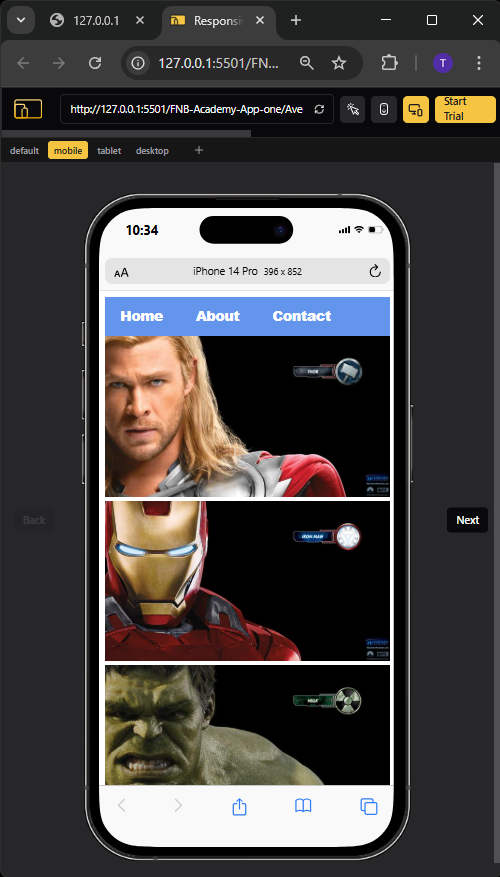

# Avengers Gallery – Original Version (FNB App Academy)

This is my **first web project** built as part of the FNB App Academy 2025. It features a simple image gallery of Avengers characters created using basic HTML and CSS.

## 🌐 Project Overview

The goal of this project was to apply fundamental HTML and CSS knowledge to build a static webpage. It includes:

- A basic navigation menu
- A responsive gallery layout
- Avengers character images linked to individual character pages

## 🛠️ Built With

- HTML5
- CSS3

## 🚀 Features

- Simple navigation bar using `
` and styled links
- Image gallery layout with full-width scaling
- Font styling and color customization
- Basic hover effect on menu items

## 📁 Folder Structure

## 📸 Preview

## 👨‍💻 Author

**Tshepang Oliver**  
FNB App Academy 2025  
[GitHub Profile](https://github.com/T5H3P4N9)
[LinkedIn Profile](https://www.linkedin.com/in/tshepang-oliver-3a5540205/)
